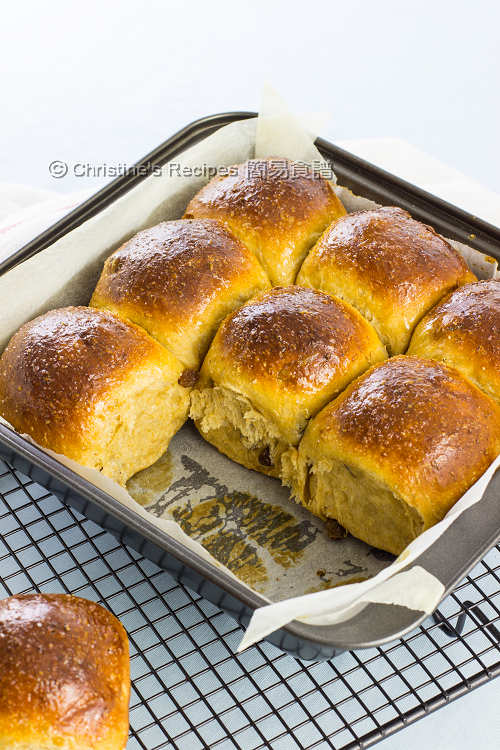

{ width=600 }

## 材料

| 食材 | 數量 | 百分比 |
|------|------|--------|
| 鮮奶 | 110g | 31% |
| 水 | 100g | - |
| 全蛋汁 | 45g | 13% |
| 黑糖 | 45g | 13% |
| 鹽 | 5g | 1% |
| 高筋粉 | 217g | - |
| 全麥粉 | 150g | - |
| 快速乾酵母 | 6g | 2% |
| 無鹽牛油 | 40g | 11% |
| 提子乾 | 85g | 24% |

## 補充資料

- **Hydration:** 69% (包括雞蛋)  
- **焗爐溫度:** 170°C，20–25 分鐘  

### Notes
**湯種 1:5**  
- 高筋粉 50g (17%)  
- 水 250g (83%)  
