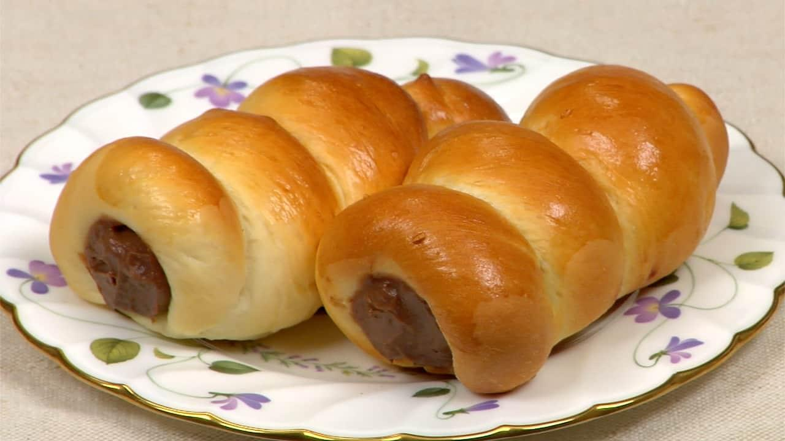

{ width=600 }

## 材料

### 麵包體 (6 個)
- 日製高筋麵粉 150g  
- 砂糖 12.5g (9%)  
- 鹽 2.5g (2%)  
- 脫脂奶粉 2.13g (2%)  
- 即發乾酵母 3.15g (2%)  
- 水 85g (61%)  
- 無鹽牛油 15g (11%)  
- 蛋 1tbsp  
- 蛋汁 — 掃面用  

### 巧克力吉士餡
- 蛋黃 2 個  
- 砂糖 31.25g  
- 鮮奶 200ml  
- 低筋麵粉 6.25g  
- 粟粉 16.25g  
- 可可粉 7.38g  
- 無鹽牛油 10g  
- 巧克力 30g  

## 烘焙
- 200°C, 10–12 分鐘  

## Notes
- 含水量：57%  
- [YouTube 影片教學](https://www.youtube.com/watch?v=6OELw6H-8BI)  

### 吉士餡做法
1. 鮮奶煮滾。  
2. 蛋黃與砂糖攪拌均勻。  
3. 加少量熱鮮奶進去蛋黃混合物，攪拌均勻。  
4. 加入低筋麵粉、粟粉和可可粉，攪拌均勻。  
5. 倒入其餘鮮奶，邊攪拌邊加熱。  
6. 中小火煮至濃稠。  
7. 加入無鹽牛油和巧克力，攪拌至順滑。