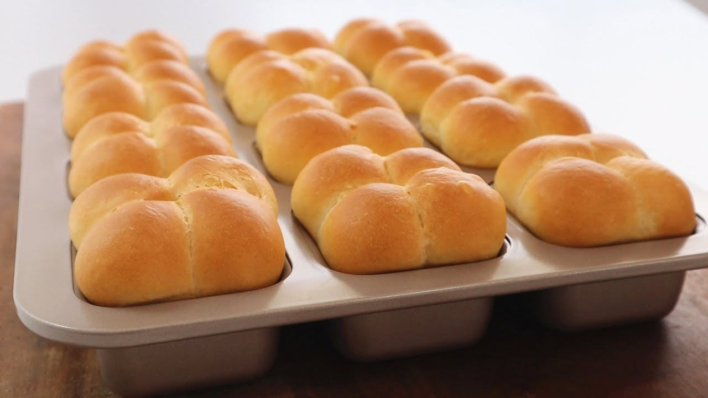

{ width=600 }

## 材料

- 高筋麵粉 300g  
- 砂糖 10g  
- 鹽 5g  
- 鮮奶 120g  
- 蛋 55g（約 1 隻）  
- 即發乾酵母 5g  
- 無鹽牛油 30g  
- 煉乳 40g  

## 做法
1. 將高筋麵粉、砂糖、鹽、酵母混合。  
2. 加入鮮奶與蛋，揉至成團。  
3. 加入牛油，繼續揉至表面光滑有彈性。  
4. 加入煉乳，揉勻至完全吸收。  
5. 一次發酵至 2 倍大。  
6. 排氣、分割成型，放置第二次發酵。  
7. 烘焙至金黃色（時間與溫度可參照影片）。  

## 參考來源
[原食譜](https://www.youtube.com/watch?v=yJSaFAr8aOA&t=398s)