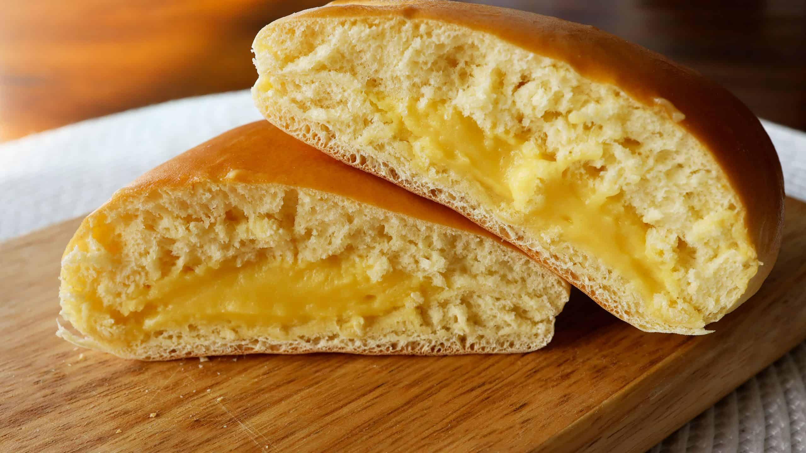

{ width=600 }

## Custard Cream
- 蛋黃 2  
- 細砂糖 25g  
- 鮮奶 140ml  
- 中筋麵粉 25g  
- 雲呢拿香油 1茶匙  

**做法**  
1. 蛋黃與砂糖打至顏色變淺。  
2. 加入麵粉拌勻，再慢慢加入鮮奶，邊加邊攪拌。  
3. 小火加熱，不停攪拌至濃稠。  
4. 熄火後加入香草精，攪拌均勻。  
5. 放涼備用。  

---

## 麵糰 (Dough)
- 蛋黃 2  
- 細砂糖 25g  
- 鮮奶 140ml  
- 中筋麵粉 25g  
- 雲呢拿香油 1茶匙  

**做法**  
1. 將麵粉、砂糖、鹽、酵母混合。  
2. 慢慢加入鮮奶，搓成團。  
3. 加入牛油，繼續搓至光滑有彈性。  
4. 發酵至兩倍大。  
5. 排氣後分割，包入卡仕達餡，整形成型。  
6. 二次發酵至 1.5 倍大。  

---

## 烘焙
- 攝氏 180°C  
- 烘焙 15–17 分鐘  
