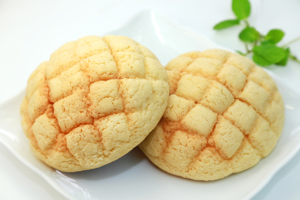

{ width=600 }

## 材料

### 麵糰 (5 個)
- 日製高筋麵粉 140g  
- 砂糖 25g (18%)  
- 脫脂奶粉 5g (4%)  
- 鹽 2g (1%)  
- 即發乾酵母 3g (2%)  
- 水 70g (50%)  
- 無鹽牛油 15g (11%)  
- 蛋 (1 tbsp)  

### 面皮
- 無鹽牛油 25g  
- 砂糖 35g  
- 蛋 25g  
- 低筋麵粉 80g  
- Baking powder 1g  
- 砂糖（沾面用）  

## 做法
### 面皮製作
1. 牛油放室溫，打至軟身。  
2. 砂糖分兩次加入，打勻。  
3. 雞蛋逐少加入，每次都要打勻。  
4. 低筋粉 + baking powder 過篩兩次。  
5. 分三次加入粉類，用刮刀輕力拌勻。  
6. 最後用保鮮紙捲成一條，放入雪櫃。  
7. 雪凍後分成 5 份，搓圓。  
8. 以保鮮紙上下墊住，用麵糰刮壓至約 9cm (3.5")。  
9. 發酵時將面皮放雪櫃冷藏，方便操作。  
10. 麵糰完成第一次發酵後，將面皮包住麵糰，收口，表面沾滿砂糖。  
11. 用麵包刮在表面劃紋，然後進行第二次發酵。  

## 烘焙
- 水合比例 (Hydration)：50%  
- 烤焗溫度：170°C，12 分鐘  

## 參考影片
[YouTube - 日本蜜瓜包 Melonpan](https://www.youtube.com/watch?v=5z0e-GKJA10)  
