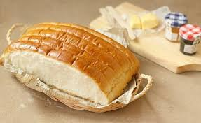

{ width=600 }

## 材料 (33×22.9×5cm 烤盤, Original)

- 高筋麵粉 500g  
- 即發乾酵母 4g (0.8%)  
- 奶粉 20g (4.0%)  
- 砂糖 25g (5.0%)  
- 鮮奶 350g (70.0%)  
- 煉奶 60g (12.0%)  
- 鹽 9g (1.8%)  
- 無鹽牛油 80g (16.0%)  

### 搽面

- 蛋黃 1 個  
- 鮮奶 1 tsp  

---

## 材料 (22.9×22.9×5cm 烤盤, My version)

- 高筋麵粉 370g  
- 即發乾酵母 2.96g  
- 奶粉 14.8g  
- 砂糖 18.5g  
- 鮮奶 259g  
- 煉奶 44.4g  
- 鹽 6.66g  
- 無鹽牛油 59.2g  

---

## 做法

1. 將所有材料混合並搓揉至麵糰光滑有筋度。  
2. 發酵至兩倍大。  
3. 分割等份麵糰，滾圓，整形成排包。  
4. 排入烤盤，二次發酵至 8 分滿。  
5. 表面掃上蛋黃鮮奶混合液。  
6. 預熱焗爐至 180°C，焗約 18 分鐘。  

---

📺 [參考影片](https://www.youtube.com/watch?v=67ZK4EjZMNU)
