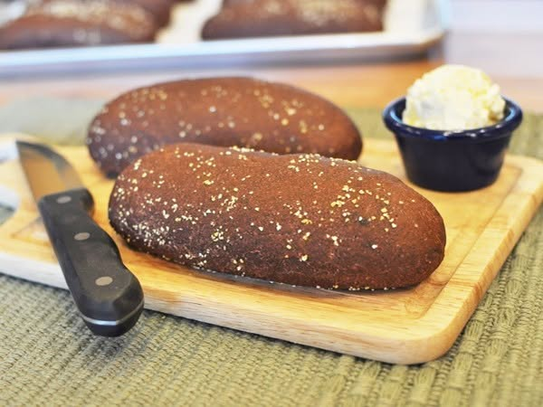

{ width=600 }

## 材料 (11 個)

- T45 麵粉 658g  
- 高筋粉 Bread flour 73g  
- 可可粉 Cocoa powder 15g (2.05%)  
- 速效乾酵母 Instant yeast 8g (1.09%)  
- 水 (38°C, 溶解酵母用) 18g (2.46%)  
- 鹽 15g (2.05%)  
- 黑糖蜜 Molasses 110g (15.05%)  
- 砂糖 74g (10.12%)  
- 雞蛋 66g (9.03%)  
- 無鹽牛油 88g (12.04%)  
- 水 402g (54.99%)  
- 粗粒小麥粉 Semolina (表面用)  

---

## 做法

1. 酵母用攝氏 38°C 溫水融開。  
2. 酵母水加入主水份，再於盆中逐步加入雞蛋、鹽、麵粉及可可粉。  
3. 拌勻麵糰後，倒在桌面上搓揉至光滑無顆粒。  
4. 加入一半砂糖，開始「撻麵糰」：將麵糰前三分一拿起，向前拋長並撻到桌面，再捲起。  
5. 重複撻至光滑，再加入餘下的砂糖，繼續撻至麵糰細緻。  
6. 分次加入黑糖蜜，搓揉並撻至麵糰起筋。  
7. 加入已軟化的牛油，搓揉及撻至有彈性。  
8. 蓋保鮮紙，於 25°C 下發酵 1 小時至約 1.5 倍大。  
9. 分割成 11 份，每份約 120g，滾圓靜置 20 分鐘。  
10. 麵糰表面蘸麵粉，將麵糰三分一摺入並壓緊，重複兩次，整形成長條。  
11. 發酵 45 分鐘至兩倍大。  
12. 表面撒粗粒小麥粉，避免焗時黏焗盤。  
13. 焗爐預熱至 210°C，焗 15 分鐘即可。  

---

## 影片參考
[YouTube 教學](https://www.youtube.com/watch?v=ZHwupxu3dzU&ab_channel=%E9%A3%B2%E9%A3%9F%E7%94%B7%E5%A5%B3)