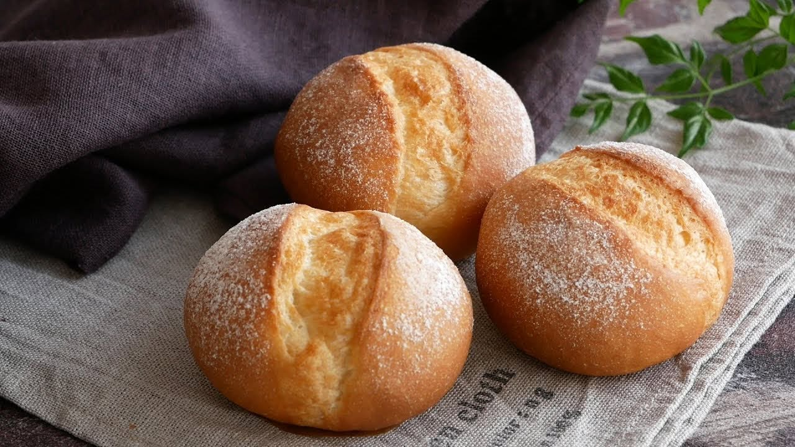

{ width=600 }

## 材料

### 原版配方 (8 個)
- 高筋麵粉 150g (100%)  
- 砂糖 8g (5%)  
- 鹽 2g (1%)  
- 水 40g (27%)  
- 牛奶 60g (40%)  
- 即發乾酵母 2g (1%)  
- 無鹽牛油 12g (8%)  
- 總重量：約 274g  
- 每個麵包：約 34.25g  

**撒面粉：** 高筋麵粉 (適量)  
**餡料：** 鹽牛油 16g (2g × 8)  

---

### 我的版本 (12 個)
- 高筋麵粉 400g (100%)  
- 砂糖 21.3g (5%)  
- 鹽 5.3g (1%)  
- 水 106.7g (27%)  
- 牛奶 160g (40%)  
- 即發乾酵母 5.3g (1%)  
- 無鹽牛油 32g (8%)  
- 總重量：約 730.7g  
- 每個麵包：約 60.9g  

---

## 焗爐
- 230°C，焗 13 分鐘  