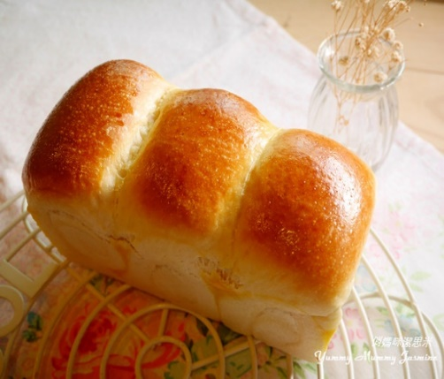

{ width=600 }

## 材料

### Original (2 個山形)
- 高筋麵粉 250g (100%)
- 砂糖 12.5g (5%)
- 鹽 5g (2%)
- 脫脂奶粉 5g (2%)
- 無鹽牛油 10g (4%)
- 雪白油 10g (4%)
- 即發乾酵母 2.5g (1%)
- 水 195g (78%)

### 我的版本 (3 個山形, 大模具)
- 高筋麵粉 420g (100%)
- 砂糖 21g (5%)
- 鹽 8.4g (2%)
- 脫脂奶粉 29.4g (7%)
- 無鹽牛油 33.6g (8%)
- 即發乾酵母 4.2g (1%)
- 水 147g (35%)
- 鮮奶 147g (35%)

### 湯種法 (3 個山形)
- 高筋麵粉 50g  
- 水 50g  

## 烘焙
- 210°C, 30 分鐘（開蓋）  
- 220°C, 30 分鐘（關蓋）  

## Notes
- 含水量：70%  
- 水可以用牛奶代替，比例 1:1.1  
