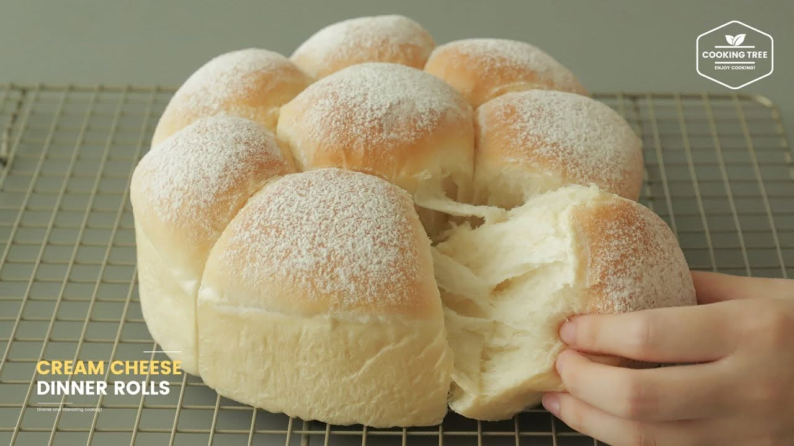

{ width=600 }

## 材料
- 高筋麵粉 310g  
- 砂糖 30g  
- 鹽 3g  
- 即發乾酵母 4g  
- 鮮奶 170g  
- 蛋 1 隻  
- 無鹽牛油 20g  
- Cream cheese 50g  

## 焗爐
- 圓形模具分 8 等份  
- 150°C，焗 20 分鐘  

## 做法
1. 所有材料攪勻成麵團，搓至出薄膜。  
2. 第一次發酵至雙倍大。  
3. 分割成 8 等份，滾圓，放入圓形模具。  
4. 進行最後發酵，至麵團脹滿模具。  
5. 預熱焗爐，150°C，焗 20 分鐘至表面金黃。  

## 影片參考
[YouTube 教學](https://www.youtube.com/watch?v=UDsYheHNE1o)  
