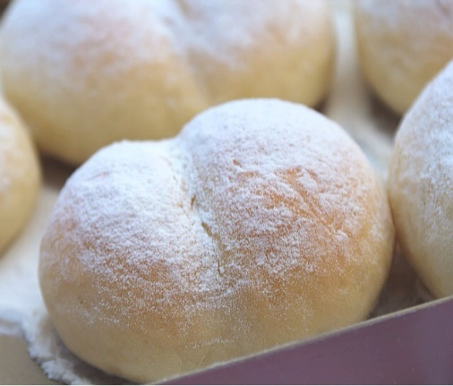

{ width=600 }

## 材料

### Original (8個)

| 食材 | 數量 | 百分比 |
|------|------|--------|
| 日製高筋麵粉 | 210g | - |
| 低筋麵粉 | 40g | - |
| 砂糖 | 20g | 8% |
| 脫脂奶粉 | 7g | 3% |
| 鹽 | 3g | 1% |
| 即發乾酵母 | 3g | 1% |
| 牛奶 | 85g | 34% |
| 水 | 80g | 32% |
| 無鹽牛油 | 20g | 8% |

### 湯種 Version (8個)

| 食材 | 數量 |
|------|------|
| 日製高筋麵粉 | 194g |
| 低筋麵粉 | 40g |
| 砂糖 | 20g |
| 脫脂奶粉 | 7g |
| 鹽 | 3g |
| 即發乾酵母 | 3g |
| 牛奶 | 85g |
| 水 | 2g |
| 無鹽牛油 | 20g |
| 湯種 | 94g |

## 補充資料

- **水合比 (Hydration):** 66%  
- **焗爐溫度:** 150°C，15–18 分鐘  

### Notes
- 外國高筋粉：加牛奶 90g，水 85g  
- 可以用筷子中間壓痕，造成 **pat pat** 造型  
- 可以加 **custard** 做餡，變成忌廉包  
- 日本忌廉包造型 👉 [YouTube](https://www.youtube.com/watch?v=3FGJQkucagI)  

**湯種 (93.6g)：**  
- 麵粉 15.6g  
- 水 78g  
> 湯種做法：100°C 滾水加落麵粉撈勻，放涼後放入雪櫃最少 8 個小時。  
