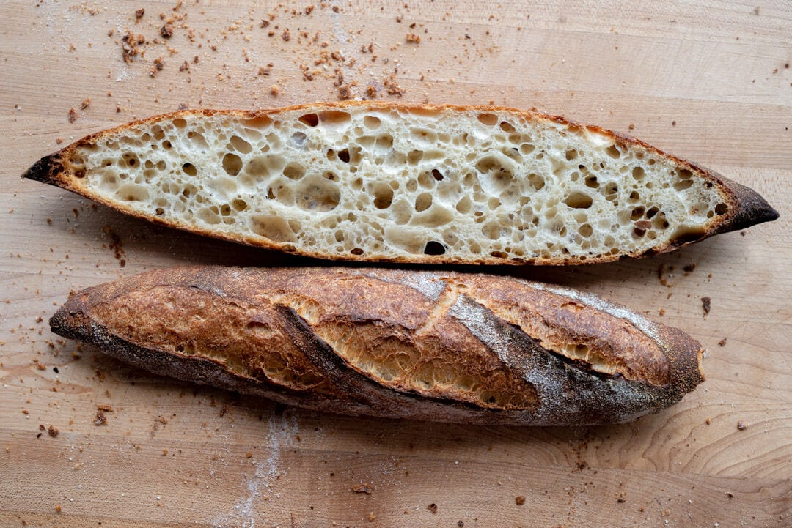

{ width=600 }

## Levain (3 hrs)
- Starter (100% hydration) 47g  
- Bread flour 47g  
- Water (26°C) 47g  

## Autolyse (1 hr)
- Bread flour 1009g  
- High protein flour 117g  
- Water 710g  

## Mix (FDT 26°C)
- Water 100g  
- Salt 24g  

## 發酵 & 整形
- Warm bulk fermentation 1 小時 45 分鐘，期間每 30 分鐘進行一次stretch & folds，共 3 次。  
- 隔夜冷藏發酵（建議），或繼續進行 1–1.5 小時warm bulk fermentation。  
- 分割麵糰，每份 350g，鬆弛 10 分鐘後整形成型。  
- 在 couche 上發酵 1 小時 45 分鐘。  

## 烘焙
- 預熱焗爐至 260°C，提前 1 小時。  
- 入爐加蒸氣，溫度降至 246°C，烘焙 20 分鐘。  
- 移除蒸氣，降至 232°C，再烘焙 20–25 分鐘。  
- 建議分兩批烘焙：先烤 3 條，餘下放冰箱等待第二批。  

## 時間表
- 08:25 Mix levain  
- 08:40 Start levain  
- 10:25 Mix autolyse  
- 10:40 Autolyse  
- 11:40 Levain finish  
- 12:10 Mix finish & warm bulk start  
- 12:40 1st stretch & fold  
- 13:15 2nd stretch & fold  
- 13:50 3rd stretch & fold  
- 15:25 Bulk finish  
- 15:45 Preshape rest done  
- 16:05 Final shape done & start proof  
- 16:50 Preheat oven  
- 17:40 Boil water  
- 17:50 Finish proof  
- 18:30 Done  
