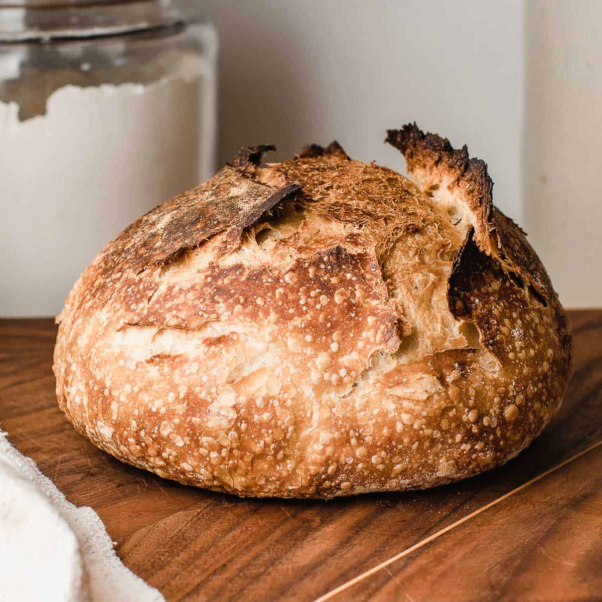

{ width=600 }

## 材料
- Bread flour 450g (100%)  
- Water 310g (69%)  
- Salt 8g (2%)  
- Sourdough 100g (22%)  

### Hydration
72%  

## 烘焙
- 230°C 15 分鐘  
- 190°C 20–25 分鐘  

## 做法
1. 所有材料混合（無需自溶 autolyse）。  
2. 30 分鐘後，進行第一次摺疊。  
3. 1 小時後，第二次摺疊（可省略）。  
4. 1 小時後，第三次摺疊。  
5. 1 小時後，第四次摺疊。  
6. 1 小時後，第五次摺疊（可省略，此時可進行預整形）。  
7. 1 小時後，第六次摺疊（最後一次，需撒粉）。  
8. 放入冰箱冷藏發酵過夜。 