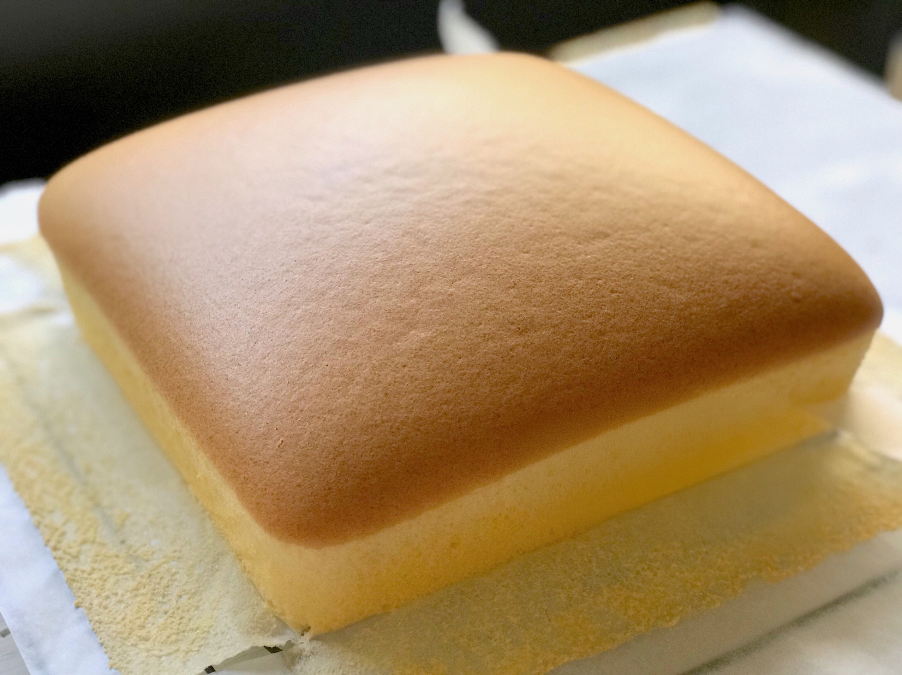

# 古早味蛋糕

{ width=600 }

## 材料

### 20cm 方形模
- 低筋麵粉 115g  
- 無鹽牛油 115g  
- 鮮奶 115g  
- 蛋黃 7 隻  
- 蛋白 7 隻  
- 砂糖 115g  
- Vanilla extract 少許  

## 做法

1. 將牛油與鮮奶隔水加熱至溶化。  
2. 分次加入蛋黃拌勻。  
3. 篩入低筋麵粉，拌勻。  
4. 打發蛋白至起泡，分三次加入砂糖，打至濕性發泡。  
5. 將部分蛋白拌入蛋黃糊，再倒回其餘蛋白中攪勻。  
6. 倒入模具，輕震去氣泡。  
7. 隔水焗，150℃ 約 65–70 分鐘。  

