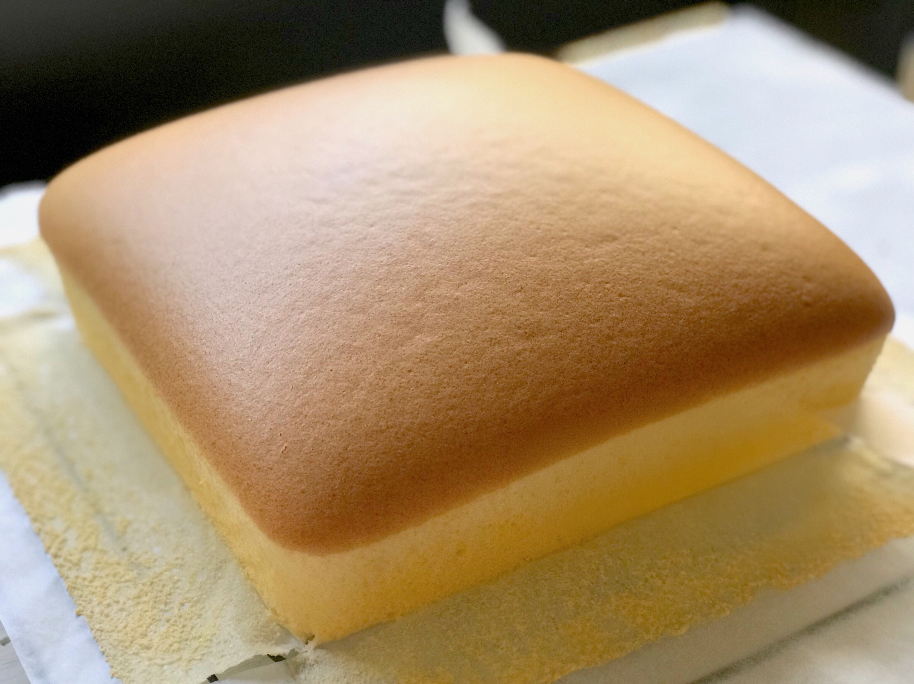

# 古早味芝士蛋糕

{ width=600 }

## 材料

- 低筋麵粉 50g  
- 無鹽牛油 70g  
- 鮮奶 120g  
- 蛋黃 6  
- 蛋白 6  
- 砂糖 80g  
- cream cheese 320g  

## 做法

1. 將牛油與鮮奶隔水加熱至溶化，拌入 cream cheese 攪勻。  
2. 分次加入蛋黃拌勻。  
3. 篩入低筋麵粉，攪拌均勻。  
4. 打發蛋白至起泡，分三次加入砂糖，打至濕性發泡。  
5. 將部分蛋白加入蛋黃糊中拌勻，再倒回其餘蛋白中拌勻。  
6. 倒入模具，輕震去氣泡。  
7. 隔水烘焙，150℃ 約 65–70 分鐘。  

