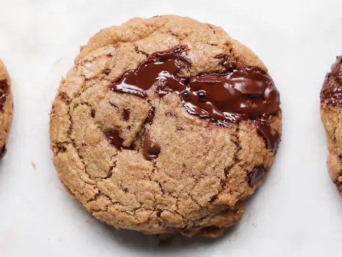

# 巧克力曲奇（Tasty 版）

{ width="600" }

## 材料
- 高筋麵粉 135g  
- 中筋麵粉 90g  
- 黑糖 220g  
- 白糖 100g  
- 雞蛋 1 + 蛋黃 1  
- 香草精 8.4g  
- 即溶咖啡粉 3g  
- 小蘇打粉 6g  
- 鹽 12g  
- 牛油 226g（炒成焦香牛油）  
- 水 30–45g（按蒸發補回）  
- 半甜朱古力粒 90g  
- 黑朱古力塊 142g  

## 做法
1. 將高筋粉、中筋粉、鹽和小蘇打粉篩勻。  
2. 牛油中火加熱至呈焦糖色並有堅果香氣，離火，補回水分，放涼至室溫。  
3. 用打蛋器將黑糖、白糖、香草精、咖啡粉與焦化牛油攪打至輕盈蓬鬆。  
4. 加入蛋和蛋黃攪勻。  
5. 分三次加入粉類，輕輕攪拌，不要過度混合。  
6. 拌入朱古力粒與朱古力塊。  
7. 將麵糰分份放在焗盤，放雪櫃冷藏至少 1 小時（最佳隔夜）。  
8. 預熱焗爐 180°C，焗 12–14 分鐘。  
9. 出爐後在焗盤上放涼 2–3 分鐘，再移至架上完全冷卻。  

## 料理小分類
- 烘焙  
- 曲奇  

## 來源
[Tasty 原食譜](https://tasty.co/article/marietelling/brown-butter-chocolate-chip-cookies)
