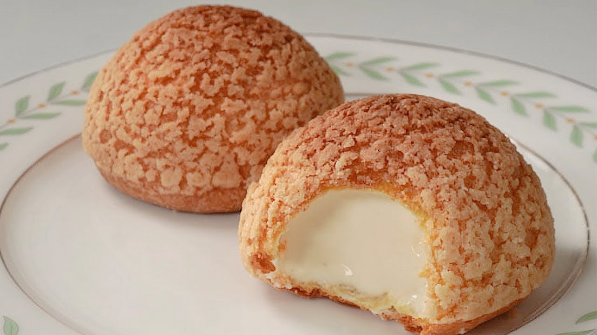

# 泡芙

{ width=600 }

## 材料

### 曲奇皮
- 無鹽牛油（室溫） 66g  
- 糖 80g  
- 低筋麵粉 80g  

### 泡芙麵糊 (Choux paste)
- 低筋麵粉 130g  
- 牛奶 130g  
- 水 130g  
- 無鹽牛油 120g  
- 鹽 4g  
- 雞蛋 6 隻  

### 餡料 (Filling)
- 雞蛋 4 隻  
- 糖 70g  
- 粟粉 20g  
- 牛奶 400g  
- 雲呢拿香油 2 茶匙  
- whipping cream 340g  
- 糖 34g  

## 做法

1. 將糖與牛油拌勻，再加麵粉攪勻。  
2. 放入保鮮袋碾成 2–3mm 厚，冰格冷凍 15 分鐘後取出，用 5cm 模切圈備用。  

3. 雞蛋先打散備用。  
4. 牛油、水、牛奶和鹽煮至滾起，離火後一次過加入麵粉，快速拌勻。  
5. 開小火，攪拌至麵糊不黏鍋邊，取出放涼。  
6. 分次加入蛋液，攪拌至光滑掛勾狀。  

7. 焗爐 190℃ 15 分鐘，再 170℃ 15 分鐘，焗完後開條罅再焗 10 分鐘。  

### 卡士達餡
1. 雞蛋與糖打發至淡黃色，加入粟粉拌勻。  
2. 加入牛奶與雲呢拿香油，邊加邊拌勻。  
3. 小火煮至濃稠成卡士達醬，放涼。  
4. 打發忌廉與糖至 7 分發，與卡士達醬拌勻作餡料。  

## 參考來源
[YouTube 教學](https://youtu.be/3xtSr5iIuTo?si=zQ-MYI-Ew0y6GBMn)
