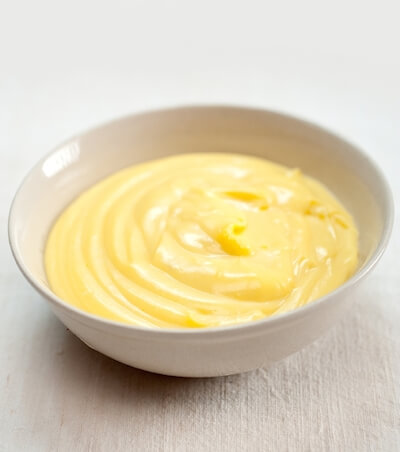

{ width=600 }

## 材料
- 鮮奶 200g（A）
- 砂糖 20g（A）
- 雲尼拿枝 1/3 枝（A）
- 蛋黃 1 個（B）
- 砂糖 20g（B）
- 鮮奶 50g（C）
- 粟粉 10g（C）
- 低筋麵粉 15g（C）
- 無鹽牛油 10g

## 做法
1. 將 200g 鮮奶、20g 砂糖和雲尼拿枝以慢火煮滾。（雲尼拿枝要切開，刮出籽。）  
2. 蛋黃與 20g 砂糖打勻。  
3. 將 50g 鮮奶、10g 粟粉、15g 低筋麵粉攪勻後倒入蛋黃混合物中，攪勻。  
4. 將步驟 1 的牛奶混合物慢慢加入（過濾），邊加邊攪勻。  
5. 用細火加熱，煮至濃稠。  
6. 加入 10g 無鹽牛油，攪勻。  
7. 在表面鋪上保鮮紙，放入雪櫃冷藏。（保鮮紙要貼住 custard 表面，避免出硬皮。）  

