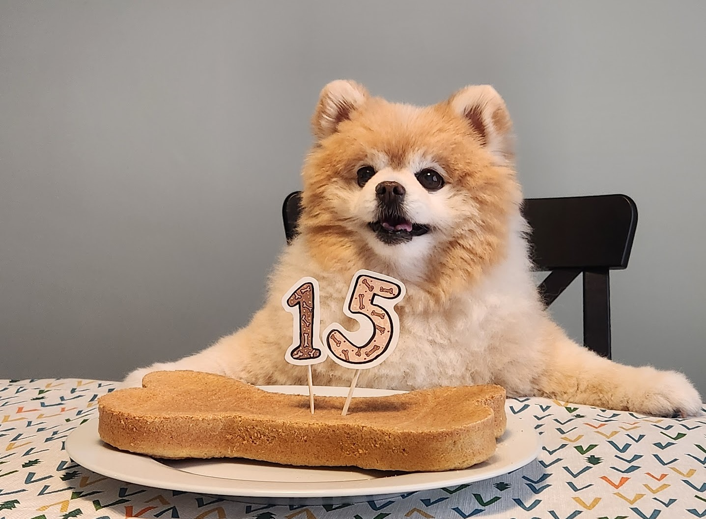

# 狗狗蛋糕

{ width="600" }

## 材料
（8 吋圓模）

- 麵粉 96g  
- Baking soda 2.4g  
- 植物油 20g  
- 花生醬 52g  
- 南瓜蓉 88g  
- 雞蛋 1 隻  

---

## 做法
1. 預熱焗爐 170°C。  
2. 將所有材料放入大碗攪拌均勻。  
3. 倒入已墊牛油紙的 8 吋圓模。  
4. 放入焗爐烘焗至熟透，約 25–30 分鐘。  
5. 放涼後即可給狗狗食用。  

---

## 料理小分類
- 烘焙  
- 狗狗甜品  

## 來源
[YouTube 教學影片](https://www.youtube.com/watch?v=67ZK4EjZMNU)
