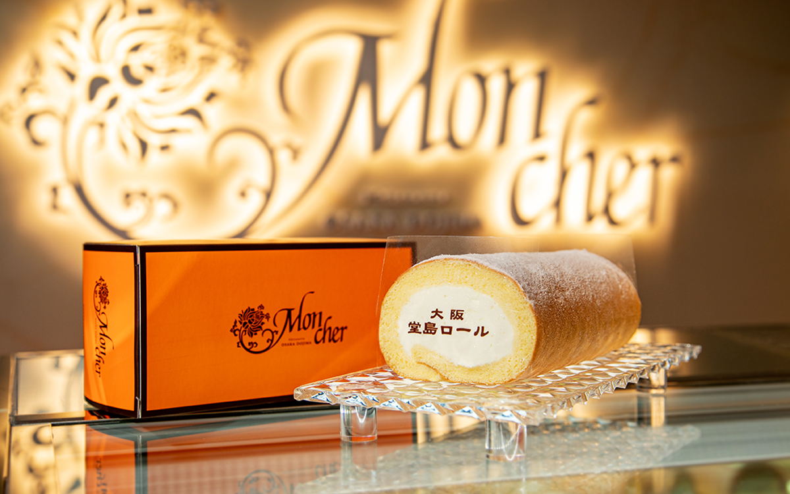

# 堂島卷

{ width="600" }

## 材料

### 蛋糕體
- 低筋麵粉 55g  
- 蛋黃 4 隻  
- 鹽 1g  
- 粟粉 15g  
- 蜜糖 15g  
- 牛奶 50g  
- 植物油 35g  
- 蛋白 4 隻  
- 砂糖 70g  

### 忌廉餡
- 動物性鮮奶油 350g  
- 煉乳 60g  

---

## 做法
1. 蛋白打至起泡，分次加入砂糖，打至 firm peak。  
2. 蛋黃逐一加入，攪拌均勻。  
3. 加入蜜糖，拌勻。  
4. 篩入低筋粉與粟粉，輕輕翻拌。  
5. 加入牛奶拌勻，再倒入植物油，混合均勻。  
6. 輕輕將麵糊倒入焗盤，輕拍排氣。  
7. 焗爐 180°C 焗 15–18 分鐘。（大蛋糕可用 160°C 焗 35 分鐘）  
8. 出爐後放涼。  

### 卷蛋糕
1. 將打發好的忌廉鋪在蛋糕上，頭部忌廉厚一些，尾部薄一些。  
2. 用卷壽司的方法將蛋糕捲起。  
3. 用牛油紙包好，放雪櫃 30 分鐘定型。  

---

## 料理小分類
- 烘焙  
- 蛋糕  
- 卷蛋糕  

