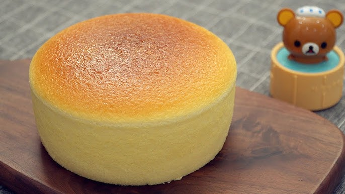

{ width=600 }

## 材料
- Cream Cheese 180g  
- 無鹽牛油 30g  
- 牛奶 100g  
- 蛋黃 3  
- 低筋粉 10g  
- Corn Starch 20g  
- 蛋白 3  
- 砂糖 60g  
- 檸檬汁 2g  

## 做法
1. 蛋白同蛋黃分開。  
2. Cream cheese、牛油、牛奶隔熱水攪溶至滑。  
3. 加入蛋黃攪勻，再加入過篩低筋粉與粟粉，攪勻。  
4. 過篩一次令麵糊更滑。  
5. 打蛋白，加少許檸檬汁，分三次加入砂糖，高速至中速打至濕性發泡。  
6. 取少量蛋白混入芝士糊拌勻，再與其餘蛋白拌勻。  
7. 倒入模具，隔水焗：150°C 30分鐘 → 110°C 60–70分鐘。  
8. 放涼後脫模享用。  
