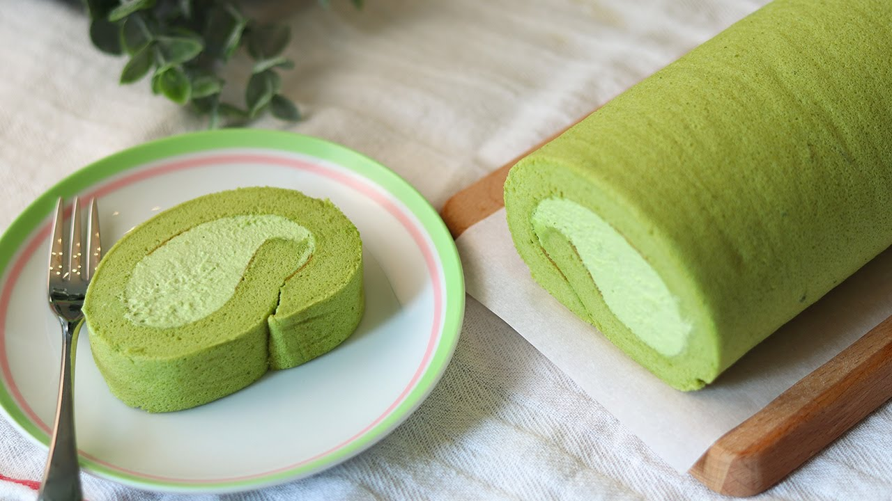

# 抹茶卷

{ width=600 }

## 材料

### 蛋糕體 (28x28cm 烤盤)
- 蛋 4 隻（55–65g，室溫）  
- 砂糖 65g  
- 低筋麵粉 60g （或中筋麵粉 50g + 粟粉 10g）  
- 油 55g（無味油）  
- 牛奶 55g（室溫）  
- 抹茶粉 6g (2.5 tsp)  
- 醋 5g (1 tsp)  

### 忌廉餡
- 鮮忌廉 (Whipping cream) 200g  
- 砂糖 25g  
- 抹茶粉 4g (1.5 tsp)  

## 做法

1. 蛋白打至起泡，分次加入砂糖，打至濕性發泡。  
2. 逐隻加入蛋黃，用打蛋器攪勻。  
3. 加入抹茶粉、麵粉，輕輕拌勻。  
4. 加入牛奶與油，攪勻。  
5. 倒入鋪有焗紙的烤盤，輕震去氣泡。  
6. 以 170℃ 焗約 25 分鐘（視乎焗爐調整）。  
7. 放涼備用。  

### 忌廉餡
1. 打發鮮忌廉、砂糖與抹茶粉至硬性發泡。  

### 組裝
1. 將蛋糕脫模，塗上忌廉餡。  
2. 用卷壽司方法將蛋糕卷起，收緊。  
3. 用焗紙包好，雪櫃冷藏 30 分鐘後切件享用。  

