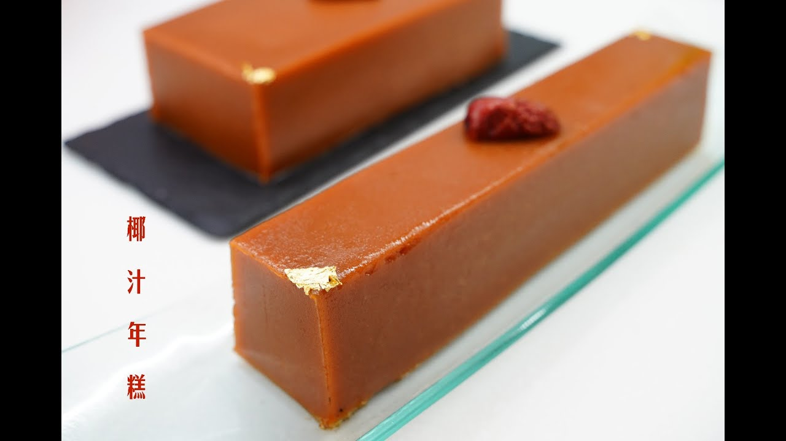

# 年糕（無油版）

{ width=600 }

## 材料

- 黑片糖 360g  
- 水 360g  
- 糯米粉 480g  
- 登麵 60g  
- 木薯粉 30g  
- 粘米粉 30g  
- 椰漿 285g  

## 做法

1. 片糖加水，中火煮溶。  
2. 將所有粉類混合，加入椰漿攪勻。  
3. 將糖水加熱至 70–80℃。  
4. 取 660g 熱糖水倒入粉漿（不足可補水），拌勻。  
5. 用廚師機中低速攪拌，直至均勻。  
6. 粉漿過篩，倒入模具。  
7. 模具輕震去氣泡，表面覆蓋保鮮紙。  
8. 大火蒸約 1 小時。  
9. 插筷子測試，如無黏漿即可。  

## 參考來源
[YouTube - 年糕製作](https://www.youtube.com/watch?v=l5Z3G7FOIuQ)
