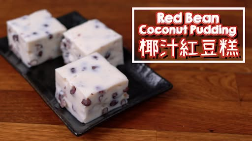

# 紅豆糕

{ width=600 }

## 材料

- 紅豆 50g  
- 椰奶 200g  
- 淡奶 50g  
- 水／紅豆水 200g  
- 粟粉 60g  
- 砂糖 65g  
- 鹽 1/8 tsp  

## 做法

1. 紅豆洗淨後用清水浸泡過夜。  
2. 用沸水煮 10 分鐘，焗 10 分鐘，重覆約三次至紅豆軟身。  
3. 瀝乾紅豆備用。  
4. 椰奶與淡奶混合，加入砂糖與鹽拌勻。  
5. 粟粉與水／紅豆水混合，拌勻。  
6. 一邊攪拌一邊倒入粟粉水，加熱至漸稠。  
7. 加入紅豆拌勻，倒入模具。  
8. 蒸至凝固即成。  

