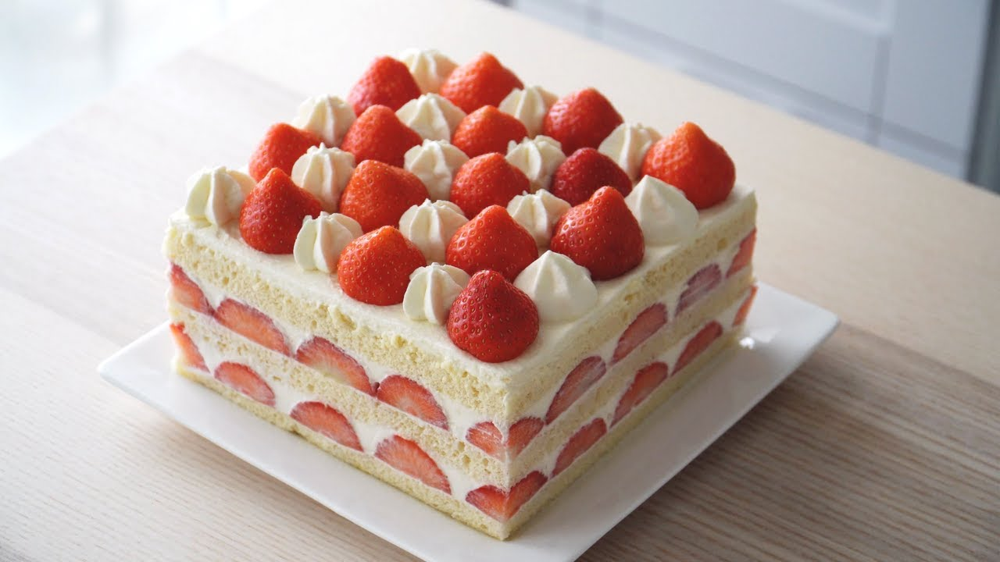

# 草莓忌廉蛋糕

{ width=600 }

## 材料

### 蛋糕體 (20.5 x 20.5cm 方形模)
- 全蛋 4.5 隻  
- 蛋黃 1.5 隻  
- 砂糖 135g  
- 低筋麵粉 135g  
- 無鹽牛油 30g  
- 牛奶 30g  
- 鮮忌廉 (heavy cream) 15g  
- 葡萄糖漿 15g  
- 士多啤梨 (Strawberries) 適量（切片作夾層及裝飾用）  

## 做法

1. 打發蛋與砂糖至泛白蓬鬆。  
2. 篩入低筋麵粉，輕輕拌勻。  
3. 牛油與牛奶加熱融化後，拌入麵糊。  
4. 倒入已鋪牛油紙的模具。  
5. 以 170℃ 焗至熟透（竹籤測試）。  
6. 將蛋糕橫向切片，分成多層。  
7. 在第一層蛋糕片上塗抹葡萄糖漿保濕，鋪上新鮮士多啤梨片。  
8. 加上一層忌廉。  
9. 重覆步驟 7–8 至完成所有層。  
10. 表面鋪上忌廉，最後以士多啤梨裝飾。  

