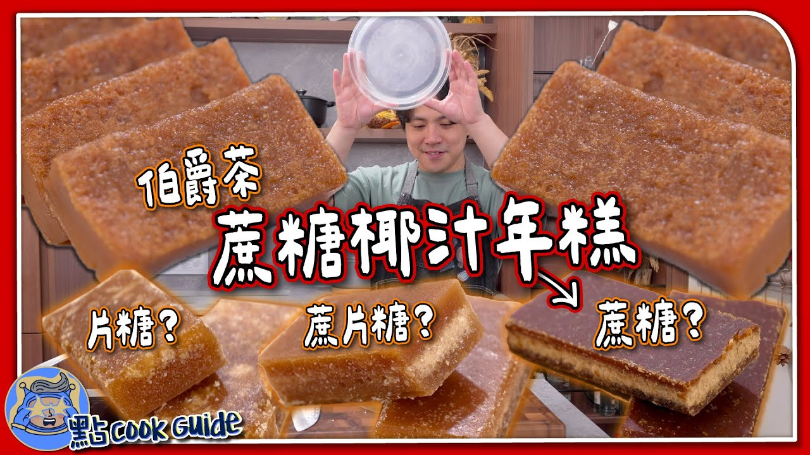

# 伯爵茶蔗糖椰汁年糕

{ width=600 }

## 材料

### 粉類
- 糯米粉 300g  
- 粘米粉 60g  
- 澄麵粉 40g  

### 液體
- 椰奶 200g  
- 水 160g  

### 糖類
- 片糖 200g  
- 黑糖 (dark brown sugar) 30g  

### 其他
- 伯爵茶包 3 包  
- 水 150g  

## 做法

1. 混合糯米粉、粘米粉及澄麵粉。  
2. 用 150g 水浸泡伯爵茶包。  
3. 將 200g 水加熱，煮溶片糖（避免水量流失，可用熱水補足）。  
4. 將椰奶加入粉類中拌勻。  
5. 把伯爵茶水加入片糖水中，總液體約 450g。  
6. 液體倒入粉類中拌勻至無粉粒，過篩。  
7. 模具抹油防黏，倒入粉漿，加蓋或保鮮紙，中火蒸約 1 小時。  
8. 開蓋再蒸 5 分鐘令表面更光滑。  
9. 放涼後加蓋或包保鮮紙，冷藏至少一晚，脫模切件後加熱享用。  

## Notes
- 只用紅片糖會唔夠甜，所以要加 brown sugar。  
- 伯爵茶可以浸耐啲。  
- 因用椰奶，所以減咗部分水量。  
- 煮糖水時要細火，避免蒸發太多水。  

## 參考來源
[YouTube - 伯爵茶蔗糖椰汁年糕](https://www.youtube.com/watch?v=xgnNk4UXqbs&t=66s)
