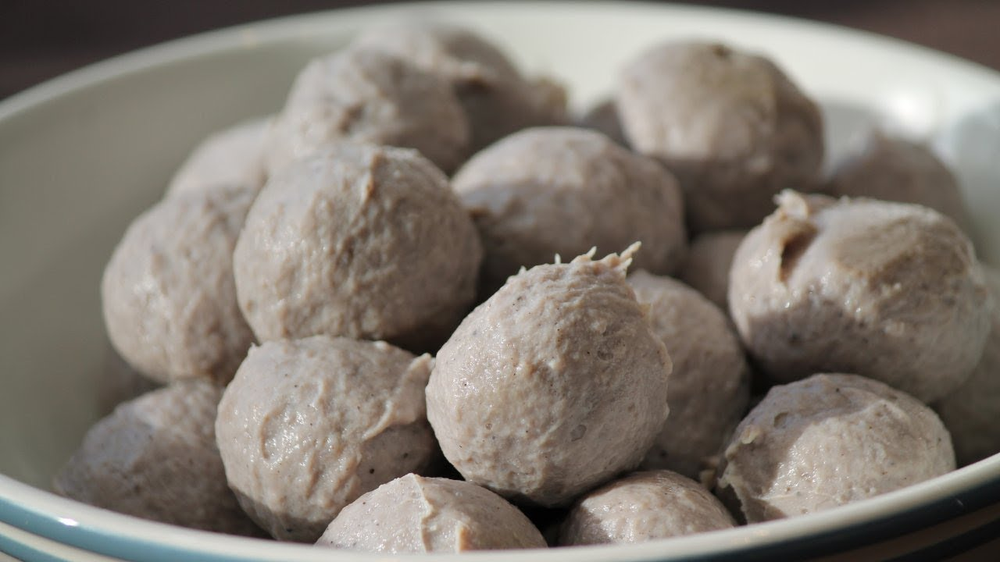

{ width=600 }

## 材料
- 牛肉 250g
- 粟粉 15g
- 泡打粉 5g
- 鹽 3g
- 魚露 5g
- 胡椒粉 1.5g
- 黑椒 1g
- 雞粉 5g
- 水 25ml

## 做法
1. 牛肉預先冷凍，然後稍為解凍。
2. 將牛肉、魚露、胡椒粉、黑椒、鹽、雞粉、泡打粉、粟粉及水攪拌成泥狀。
3. 用手攪拌肉漿至有黏性，攤平後冷藏1小時。
4. 撻打肉漿。
5. 握緊拳頭把肉漿從虎口位置擠出肉丸。
6. 放到約70℃水中煮8-10分鐘至熟透。
7. 牛丸放到冰水降溫，即成。

## 參考來源
[YouTube - 牛丸教學](https://www.youtube.com/watch?v=qLd0RgTBB9U)