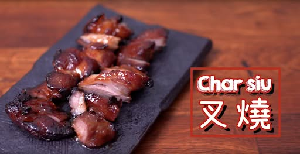

{ width=600 }

  🍽️ 份量：4
  ⏱️ 時間：前一晚醃 + 焗 25–30 分
  🧑‍🍳 難度：⭐⭐

## 材料

### 醃料
- 米酒 15g  
- 生抽 45g  
- 麥芽糖 45g  
- 糖 20g  
- 蠔油 20g  
- 胡椒粉 少量  
- 蒜頭 1瓣  
- 薑 2片  

### 蜜汁
- 麥芽糖 60g  
- 醃汁 30g  

!!! tip "蜜汁比例"
    麥芽糖以**1：2**比例加熱化開，刷面更光澤。

!!! note "焗爐差異"
    家用焗爐火力差異大，必要時最後 3–5 分鐘**轉上火**上色。

## 做法
1. 把梅頭肉切得大小平均一些。  
2. 把蠔油、豉油、胡椒粉和麥芽糖攪拌均勻，可將其放在微波爐加熱融化。  
3. 使用密實袋裝好豬肉和醬汁，加入薑和蒜頭，醃一晚。  
4. 把豬肉放在室溫攤至常溫，並可預先預熱焗爐。  
5. 將麥芽糖以1:2的比例煮溶，分開兩份蜜汁備用。  
6. 在焗盤上放上錫紙和烤架，把豬肉放在烤架上，並均勻刷上醬汁，以200度烤焗25分鐘。  
7. 每隔5分鐘取出，把豬肉反轉，再刷上醬汁，重覆程序，最後刷上餘下的蜜汁。  
8. 放涼，切片，即成。  

## 參考來源
[YouTube - 叉燒教學](https://www.youtube.com/watch?v=MR9juZ26rx4&t=642s)
