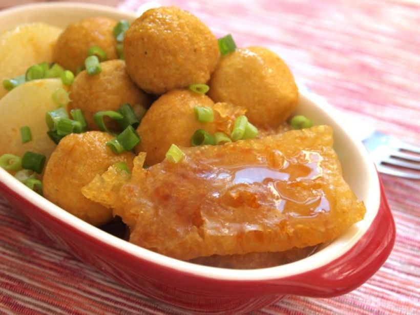

{ width=600 }

## 材料
- 蘿蔔 適量  
- 豬皮 適量  
- 魚蛋 適量  
- 片糖 1/4 塊  
- 水 2碗  
- 大孖醬園秘撈魚蛋醬 適量  

## 做法
1. 豬皮浸水1小時，沖洗多次，切件。  
2. 凍水落豬皮，加1湯匙白醋，煮滾後熄火，撈起。  
3. 蘿蔔飛水2分鐘。  
4. 用大孖醬加水開成咖喱汁。  
5. 加入蘿蔔、豬皮、魚蛋、片糖及水，小火煮10分鐘。  
