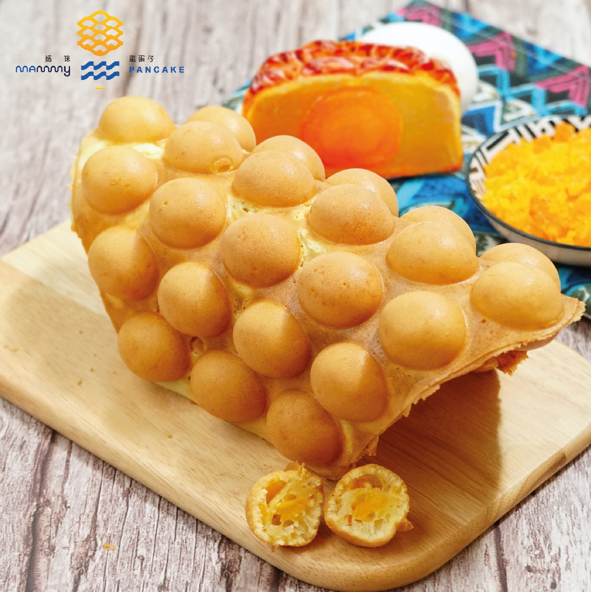

{ width=600 }

## 材料
- 麵粉 140g
- Baking powder 8g
- Custard powder 1湯匙
- 木薯粉 28g
- 雞蛋 2隻
- 砂糖 140g
- 水 140ml
- 花奶 28g
- 雲尼拿油 1茶匙
- 植物油 28g
- 植物油（搽模用）

## 做法
1. 所有乾粉類過篩。  
2. 將蛋同糖隔熱水用打蛋器打勻，手打約5分鐘。  
3. 加入花奶同水攪勻。  
4. 加入雲尼拿油同植物油攪勻。  
5. 再過一次篩。  
6. 放入雪櫃過夜或數小時。  
7. 雞蛋仔模搽少少油，倒入八成滿。  
8. 關蓋後上下左右搖勻，煎約2分30秒。  
9. 吹凍即可。  

## 參考來源
[YouTube - 雞蛋仔](https://www.youtube.com/watch?v=JBCIB-rlNyQ&t=533s)
