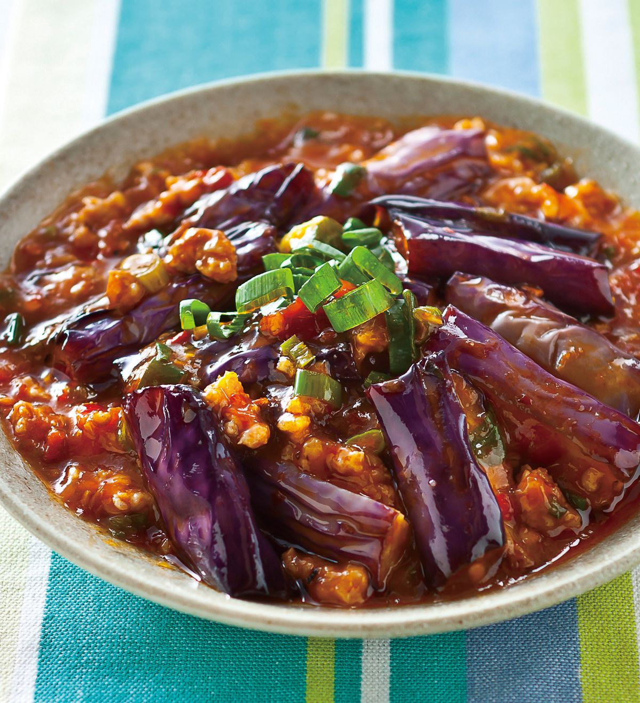

{ width=600 }

## 材料

### 醃料
- 免治豬肉 120g  
- 砂糖 ½ 茶匙  
- 胡椒粉 適量  
- 生抽 1茶匙  
- 紹興酒 1茶匙  
- 粟粉 1/2茶匙  
- 油 適量  

### 主材料
- 茄子 400g  
- 薑 2片  
- 蒜頭 2瓣  
- 辣椒 1條  
- 蔥 1束  
- 豆瓣醬 12g  
- 紹興酒 適量  
- 生抽 1茶匙  
- 砂糖 1茶匙  
- 水 130ml  
- 粟粉 1茶匙  
- 蠔油 適量  
- 麻油 適量  

## 做法
1. 免治豬肉加胡椒粉、生抽、砂糖、紹興酒、粟粉及油拌勻，醃15分鐘。  
2. 薑、蒜切蓉，辣椒剪碎，蔥切段備用。  
3. 茄子切件蒸熟。  
4. 另將生抽+砂糖調勻。  
5. 粟粉加30ml水調勻。  
6. 預熱油鍋，炒香蔥段、蒜蓉及半份辣椒。  
7. 加入豆瓣醬炒勻，再加入免治豬肉炒散。  
8. 加紹興酒、調味汁、100ml水及茄子炒勻。  
9. 落蠔油炒勻，最後落粟粉水埋芡。  
10. 加麻油，撒辣椒及蔥花完成。  

## 參考來源
[YouTube - 魚香茄子](https://www.youtube.com/watch?v=GtjVQS3meAk&t=447s)
