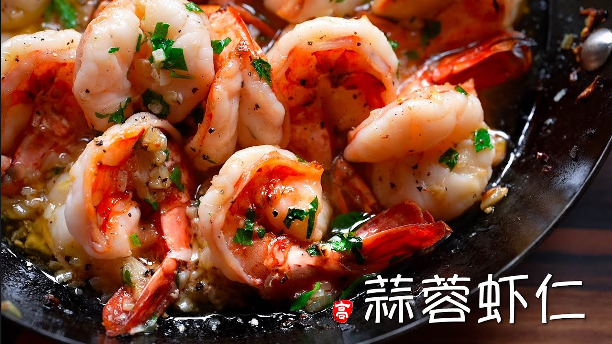

{ width=600 }

## 材料
- 虎蝦 600g  
- 鹽 1/2 tsp  
- 黑椒 適量  
- 雞精 1/4 tsp  
- 洋蔥 適量（切碎）
- 蒜粒 適量（切碎）
- 香芹（parsley）適量（切碎）
- 牛油 適量

## 做法
1. 處理蝦後抹乾，加鹽、黑椒、雞精醃 15 分鐘。  
2. 平底鍋下油與兩大匙牛油，炒香洋葱與蒜粒。  
3. 下蝦煎至變色，翻面至半熟。  
4. 拌入香芹。  
5. 連煎鍋放焗爐最上格，焗數分鐘至更香即可。  

[YouTube - 蒜蓉蝦仁](https://www.youtube.com/watch?v=FWG_1oZTcS0&t=2s)