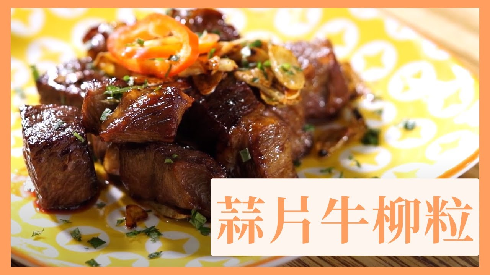

{ width=600 }

## 材料
- 日本和牛 200g  

### 醃料
- 豉油 1茶匙  
- 砂糖 1/4茶匙  
- 黑椒 1/8茶匙  
- 麻油 1/2茶匙  

### 醬汁
- 美極 1茶匙  
- 蠔油 1茶匙  
- 蜜糖 3茶匙  

### 配料
- 蒜片 適量  

## 做法
1. 牛肉切粒，加醃料撈勻，醃15分鐘。  
2. 熱鑊落油，煎香牛肉至半熟。  
3. 加入醬汁兜勻。  
4. 撒上蒜片即可。  

[YouTube - 蒜片蜜汁一口牛](https://www.youtube.com/watch?v=mFBlJ_mpwrg)