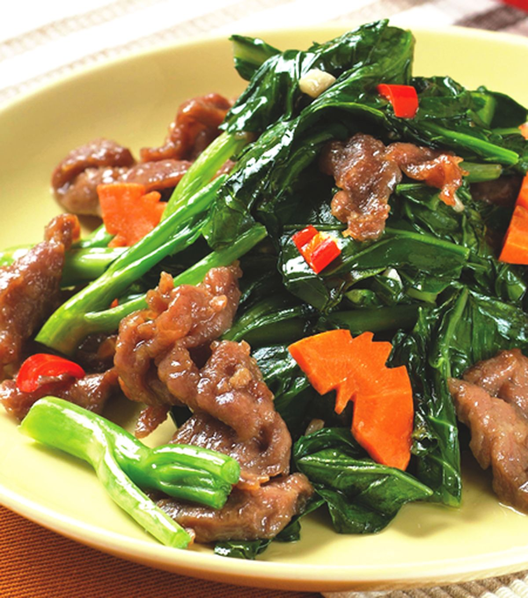

{ width=600 }

## 材料

### 主要食材
- 牛冧肉 150g
- 芥蘭 300g
- 紅黃燈籠椒 適量
- 乾蔥 15g
- 薑片 15g
- 蒜蓉 15g

### 牛肉醃料
- 生抽 1 茶匙
- 雞粉 半茶匙
- 糖 1/4 茶匙
- 蘇打粉 1/4 茶匙
- 喼汁 1 茶匙（可用檸檬汁代替）
- 室溫水或冰水 40g
- 生粉 2 茶匙
- 油 適量（封油用）

### 蠔皇芡汁
- 蠔油 1 茶匙
- 沙爹醬 半茶匙
- 雞粉 半茶匙
- 糖 1 茶匙
- 生抽 半茶匙
- 紹酒 2 湯匙
- 生粉 1/3 茶匙

### 汆燙芥蘭
- 糖 1 茶匙
- 鹽 1 茶匙
- 油 2 圈
- 清水 適量

## 做法
1. 牛冧肉逆紋切成約竹籤厚度的薄片。逆紋切可以令牛肉炒後較鬆軟嫩滑。
2. 將生抽、雞粉、糖、蘇打粉及喼汁放入碗中，加入少量室溫水或冰水拌開。
3. 將調味料加入牛肉中，輕手拌勻。待牛肉完全吸收水分後，再分次加入餘下的水，重複拌至全部吸收。
4. 加入生粉輕手拌勻，最後加入適量油封面。不要太大力或高速攪拌，以免牛肉起筋；醃好後備用。
5. 芥蘭去掉頭一兩片葉及花，頭部斜切、尾部修形，切成適合炒製的長度。紅黃燈籠椒切件；乾蔥切片。
6. 調製芡汁：將蠔油、沙爹醬、雞粉、糖、生抽、紹酒及生粉混合拌勻。沙爹醬只需少量，目的是帶出香料味，不應搶走蠔油和牛肉的味道。
7. 燒滾一鑊水，加入糖、鹽及油。先將芥蘭莖部放入水中煮約 10 秒，再放入葉部，總共煮約 1 分半鐘。
8. 將芥蘭撈起瀝乾水分，備用。芥蘭預先汆燙後，之後快炒時便不會太硬。
9. 燒熱鑊後下較多油，將要煮的牛肉一次過平鋪下鑊，全程保持大火。不要逐片放入，以免前面的牛肉受熱太久。
10. 將牛肉煎至底部有少少焦香後翻面；兩邊略有焦香、約半熟便立刻盛起，不需要煮全熟。
11. 原鑊保留煎牛肉的油，轉小火爆香蒜蓉、薑片及乾蔥，再加入紅黃燈籠椒略炒。
12. 轉大火，先將芥蘭放入鑊中墊底，再加入半熟牛肉及煎牛肉時釋出的肉汁。
13. 倒入蠔皇芡汁，同時快速兜炒，炒至醬汁均勻包裹牛肉和芥蘭便立即熄火。
14. 上碟時先放芥蘭在碟底，再放牛肉和醬汁。熄火後再盛起，可避免牛肉繼續受熱而變老。

## 重要備註
- 不要用鹽直接醃牛肉；影片提到鹽會令牛肉口感變硬，所以以生抽調味。
- 加水醃牛肉時要分次加入；每次都要拌至牛肉完全吸收水分，先再加下一次，牛肉先會嫩滑。
- 生粉拌勻後才加入油封面，作用是封住調味料和水分。
- 牛肉只需要煎至約半熟便盛起，最後與芥蘭及芡汁大火兜炒時會再熟，避免牛肉過火變老。
- 芥蘭要先汆水；水中加入糖、鹽及油，先煮莖部約 10 秒，再放入葉部，合共煮約 1 分半鐘。
- 調好芡汁後要用大火快速兜炒，醬汁一均勻包裹材料便應熄火上碟。

## 參考來源
[YouTube - 保哥煮場《芥蘭炒牛肉》家庭菜](https://www.youtube.com/watch?v=QZbldXA3IXU)
