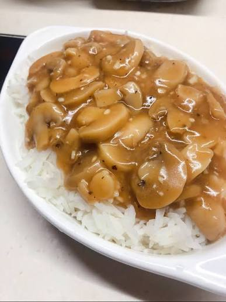

{ width=600 }

## 材料

### 主要食材
- 罐頭蘑菇 適量
- 白飯 適量

### 蘑菇汁
- 鮮牛油 適量
- 麵粉 適量
- 廚酒 適量
- 雞湯 適量
- 黑椒 適量
- 白胡椒粉 少許
- 老抽 少許（調色用）
- 鹽 適量

## 做法
1. 將罐頭蘑菇隔走所有罐頭水。
2. 蘑菇加水，開火汆水，去除罐頭異味，然後瀝乾備用。
3. 慢火煎溶牛油，加入蘑菇炒一會。
4. 加入麵粉，在鑊中同牛油炒成麵撈，慢火炒約 30 秒，炒出牛油同麵粉香味。
5. 加入廚酒。
6. 轉大火，倒入雞湯。
7. 轉返細火，將麵撈同雞湯推勻，煮成蘑菇汁。
8. 加入黑椒調味，再加少許白胡椒粉。
9. 加入少許老抽，令顏色更似 KFC 版本，再按個人口味加鹽。
10. 將蘑菇汁淋喺白飯旁邊或面上即成。

## 重要備註
- 用罐頭蘑菇比新鮮蘑菇更好，因為新鮮蘑菇有較難去除嘅草青味。
- 罐頭蘑菇一定要汆水，先可以去除罐頭異味。
- 牛油同麵粉要慢火炒約 30 秒，炒出香味先加酒同雞湯。
- 黑椒係主要調味，白胡椒粉唔使落太多。
- 老抽主要用嚟調色，令醬汁顏色更深。

## 參考來源
[YouTube - 職人吹水：KFC 蘑菇飯](https://www.youtube.com/watch?v=m9QahGiPKzU)
