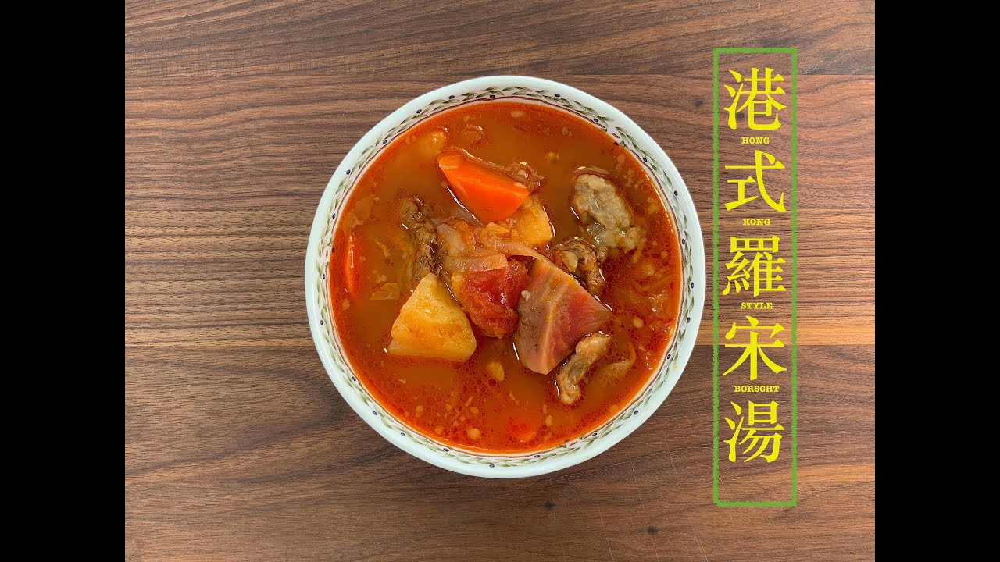

{ width=600 }

## 材料
- 紅蘿蔔 1個  
- 西芹 2條  
- 大洋蔥 2個  
- 薯仔 2個  
- 大番茄 3-4個  
- 椰菜 半個  
- 辣椒 適量  
- 蒜頭 適量  
- 牛肋條或牛尾 300g  
- 紅椒 1個  
- 月桂葉 4片  
- 雞湯 1盒  
- 番茄膏 2湯匙  

## 做法
1. 所有材料切塊。  
2. 加雞湯煲滾，大火15分鐘。  
3. 轉細火煲2小時。  

