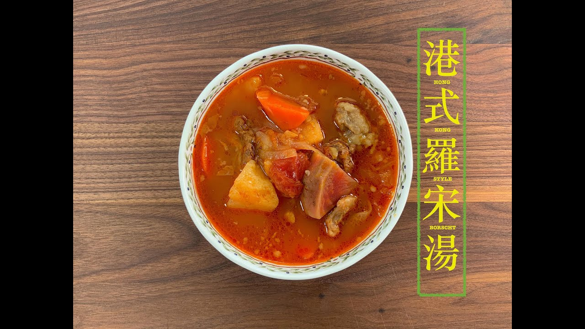

{ width=600 }

## 材料

### 主要食材
- 牛油 50g
- 洋蔥 60g
- 甘筍 60g
- 西芹 60g
- 紅甜椒 60g
- 黃甜椒 60g
- 紅菜頭 100g
- 水 3 公升
- 椰菜 800g
- 蕃茄 300g
- 檸檬 半個
- 牛筋 250g（可選）

### 調味料
- 茄膏 50g
- 茄醬（意大利粉醬）200g
- 茄汁 300g
- 糖 10g
- 鹽 10g
- 黑椒碎 4g

### 香草牛油
- 青檸葉 5g
- 牛油 100g

## 做法
1. 洋蔥、甘筍、西芹、紅黃甜椒及紅菜頭切件；椰菜及蕃茄切件備用。
2. 切甜椒時，在中間凹位落刀，切出每片都有完整弧形。頭尾部分去蒂後，在罅位切開，一併放入湯中煲。
3. 燒熱鍋，加入牛油，炒香洋蔥、甘筍、西芹、紅黃甜椒及紅菜頭。
4. 蔬菜炒香後，加入椰菜及蕃茄。
5. 加入水，如使用牛筋，可在此時一併加入。
6. 加入茄膏、茄醬及茄汁，再加入糖、鹽及黑椒碎調味。
7. 檸檬開邊，先將檸檬汁搾入湯中，再將檸檬放入湯內一齊煲。
8. 湯滾後轉細火煲一個多小時。檸檬最多煲半小時，便要撈起。
9. 第一日煲好後，待湯攤凍，放入雪櫃。
10. 第二日取出，再煲滾後轉細火，煲一個多小時，然後攤凍再放入雪櫃。
11. 第三日再將湯煲滾，便可以享用。

## 重要備註
- 除咗椰菜同蕃茄，其他蔬菜都要先炒過先放入湯中煲。
- 用牛油炒蔬菜，可以令洋蔥味道更突出。
- 牛筋可代替費時嘅牛骨湯，為羅宋湯增加肉味。
- 茄膏、茄醬同茄汁都唔可以少，可令蕃茄味更濃稠。
- 檸檬皮可為湯增加香味，但最多煲半小時；煲太耐會出苦澀味。
- 三日兩夜煲好嘅湯，蔬菜仍保留形狀，但味道已完全融入湯中。

## 參考來源
[YouTube - Ricky講煮講食：三日兩夜精煉羅宋湯](https://www.youtube.com/watch?v=95k9eQhvy2I)
