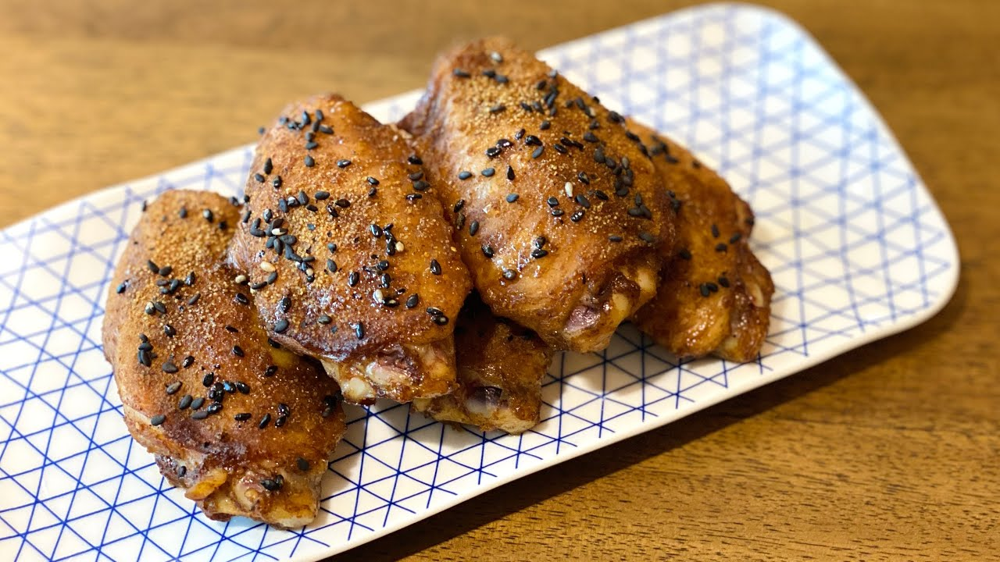

{ width=600 }

## 材料
- 雞翼 10隻  
- 孜然粉 1½茶匙  
- 五香粉 1/2茶匙  
- 辣椒粉 1/2茶匙  
- 雞粉 1茶匙  
- 砂糖 1/2茶匙  
- 生抽 1茶匙  
- 紹興酒 1茶匙  
- 麻油 1茶匙  
- 蠔油 1茶匙  
- 黑芝麻 適量  

## 做法
1. 雞翼加醃料撈勻，醃30分鐘。  
2. 表面撒上黑芝麻。  
3. 中火加蓋，每面煎3分鐘即成。（焗爐180℃ 18–20分鐘）  

## 參考來源
[YouTube - 土匪雞翼](https://www.youtube.com/watch?v=FK7eTsXRGsI%3E)
