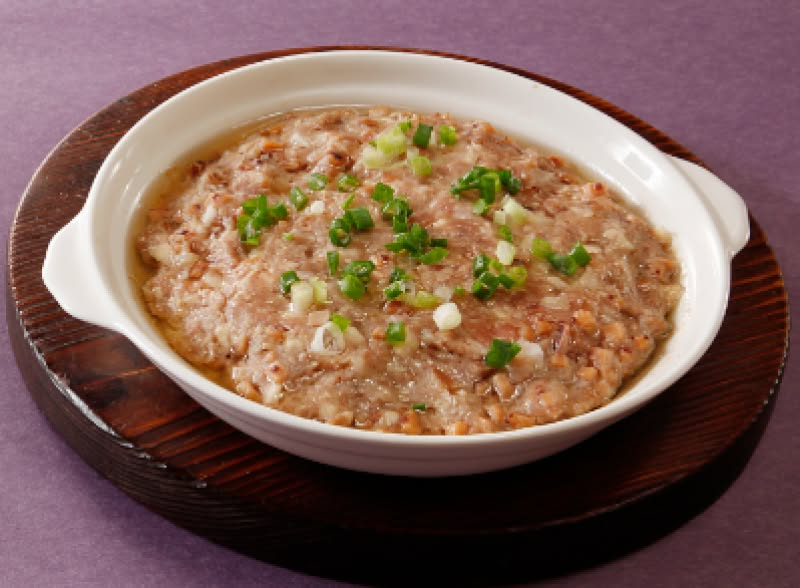

{ width=600 }

## 材料
- 免治豬肉 200g  
- 土魷 20g  
- 馬蹄 2粒  
- 蔥 適量  
- 生抽 2茶匙  
- 蠔油 1茶匙  
- 紹興酒 1茶匙  
- 砂糖 1茶匙  
- 鹽 1/8茶匙  
- 胡椒粉 少許  
- 水 30ml  
- 粟粉 2茶匙  
- 麻油 1茶匙  
- 油 1茶匙  

## 做法
1. 蔥切成蔥花。  
2. 豬肉加生抽、蠔油、紹興酒、砂糖、鹽、胡椒粉拌勻。  
3. 分次加水拌勻至吸收，再加粟粉拌勻。  
4. 加入土魷、馬蹄、蔥拌勻。  
5. 撻打肉餅。  
6. 壓平於碟，包錫紙，中火蒸15分鐘。  
7. 麻油+油燒熱，淋上肉餅即成。  

## 參考來源
[YouTube - 土魷肉餅](https://www.youtube.com/watch?v=t5dW7H__Ogk&t=525s)
