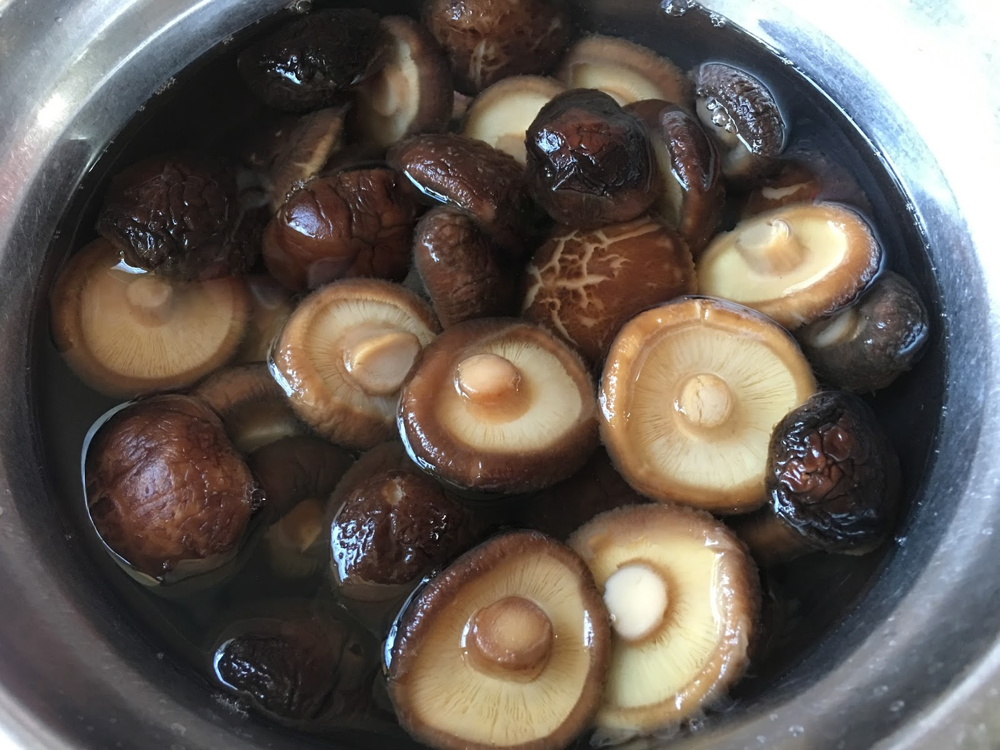

{ width=600 }

## 做法
1. 凍水浸冬菇5分鐘，落生粉搓洗，重複清洗5–6次。  
2. 落4–5倍凍水浸12–24小時，需浸過所有冬菇，可放雪櫃。  
3. 浸後連水加1粒冰糖煲滾。  
4. 中細火煮10–15分鐘，撇走浮沫。  
5. 熄火攤涼後，分裝入冰格冷藏，留冬菇水作湯底。  

## 參考來源
[YouTube - 發冬菇](https://www.youtube.com/watch?v=LqOYo6SOwuE)
