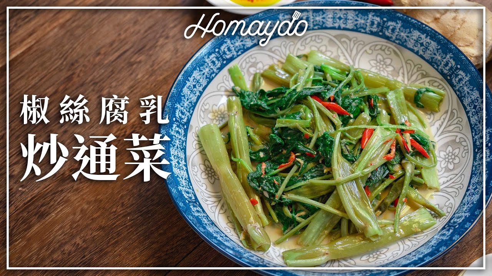

{ width=600 }

## 材料
- 通菜 600g  
- 蒜蓉 1湯匙  
- 薑絲 2茶匙  
- 辣椒絲 適量  
- 豆腐乳 2–3磚  
- 砂糖 1/2茶匙  
- 魚露 2茶匙  
- 紹興酒 2茶匙  
- 生油 2湯匙  
- 清水 100ml  

## 做法
1. 豆腐乳加紹興酒壓爛攪勻。  
2. 中火炒香薑絲、蒜蓉、腐乳醬、辣椒絲。  
3. 大火落通菜快炒。  
4. 加糖、魚露及清水，上蓋煮1分鐘。  
5. 即可上碟。  
