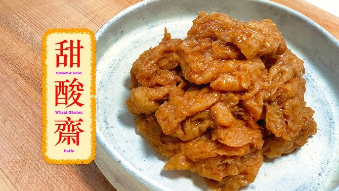

{ width=600 }

### 材料

*   • 炸麵筋 300g（英國買唔到，會用圓形嗰啲生筋代替，呢個食譜可以整到兩包生筋。）
*   • 米醋 90g
*   • 片糖 80g
*   • 冰糖 40g
*   • 茄汁 30g
*   • OK汁 40g
*   • 喼汁 10g
*   • 水 50g
*   • 鹽 0.5 茶匙

### 做法

*   1. 生筋用熱水浸一浸就得，唔需要煮，否則會爛晒。
*   2. 拿起啲生筋，用凍水沖一沖，然後揸乾啲水。
*   3. 冰糖同片糖加水煮溶。
*   4. 轉細火，加入茄汁、OK汁、米醋同鹽，慢火煮幾分鐘。
*   5. 加入生筋撈勻，煮至全部熱透就得，唔需要煮好耐，否則會爛晒。

### 參考來源

[甜酸齋教學](https://www.youtube.com/watch?v=rJCH4lkyXWU&t=212s)
