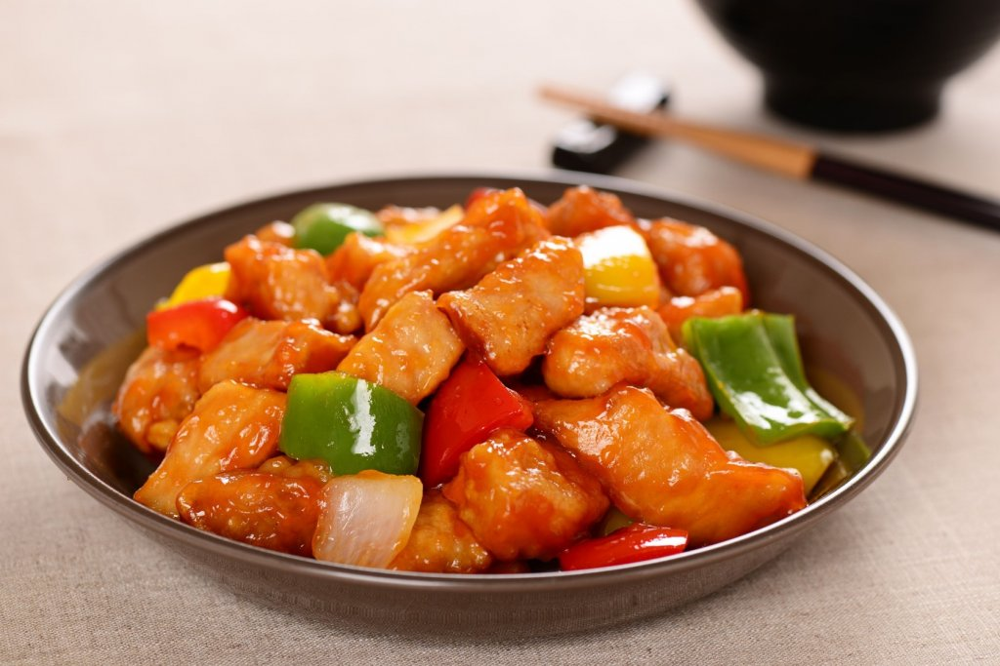

{ width=600 }

## 材料
- 五花腩 500g  
- 鹽 5g  
- 白砂糖 5g  
- 雞蛋 1隻  
- 紹興酒 20g  
- 木薯粉 5g  

### 配料
- 罐頭菠蘿片 1片  
- 綠燈籠椒 1個  
- 紅燈籠椒 1個  

### 甜酸汁
- 白醋 100g  
- 冰糖 60g  
- 片糖 40g  
- 茄汁 25g  
- 喼汁 5g  
- OK汁 30g  
- 水 20g  

## 做法
1. 豬肉切大粒，落醃料撈勻，最後落木薯粉撈勻，醃30分鐘。  
2. 醬汁：水、冰糖、片糖煮溶，加其他調味，煮至少許杰身。  
3. 豬肉上木薯粉，靜置數分鐘。  
4. 160℃油炸定型，再大火返炸至脆。  
5. 炒燈籠椒，加少許甜酸汁。  
6. 落炸好嘅豬肉炒勻。  
7. 最後加菠蘿炒熱即成。  

## 參考來源
[YouTube - 咕嚕肉](https://www.youtube.com/watch?v=itmw_ji7nA4&t=835s)
