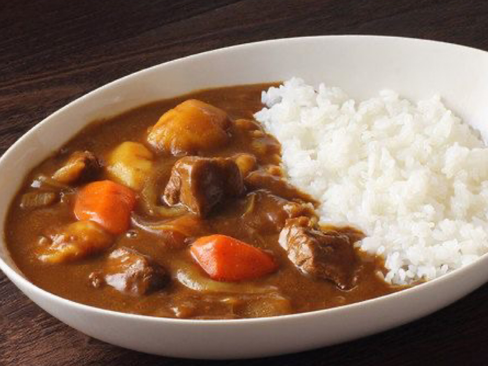

{ width=600 }

## 材料
- 牛腩 500g  
- 牛腱 500g  
- 紅蘿蔔 260g  
- 馬鈴薯 500g  
- 洋蔥 250g  
- 蒜碎 20g  
- 奶油 30g  
- 蘋果 1個  
- 咖哩塊（甜味+辣味）2盒  
- 70%巧克力 30g  
- 熱水 2500ml  

### 調味料
- 蕃茄醬 3大匙  
- 海鹽 1/2小匙  
- 昆布粉（天然鮮味粉） 2小匙  
- 咖哩粉 1大匙  
- 二砂糖 2小匙  

## 做法
1. 將紅蘿蔔、蘋果、馬鈴薯、洋蔥切塊備用。  
2. 牛腩、牛腱切塊，中大火炒1分鐘上色。  
3. 加入洋蔥、蒜碎炒至焦黃，再下蘋果炒1分鐘，最後加入奶油炒融。  
4. 倒入熱水，加入蕃茄醬、鹽、昆布粉、紅蘿蔔，小火燉40分鐘。  
5. 撈起多餘的油，加馬鈴薯，再燉15分鐘。  
6. 加入咖哩粉、咖哩塊煮化，再加巧克力、二砂糖，小火再煮10分鐘即成。  

## 參考來源
[YouTube - 日式牛肉咖哩](https://www.youtube.com/watch?v=4IGTrrH3YNE)
