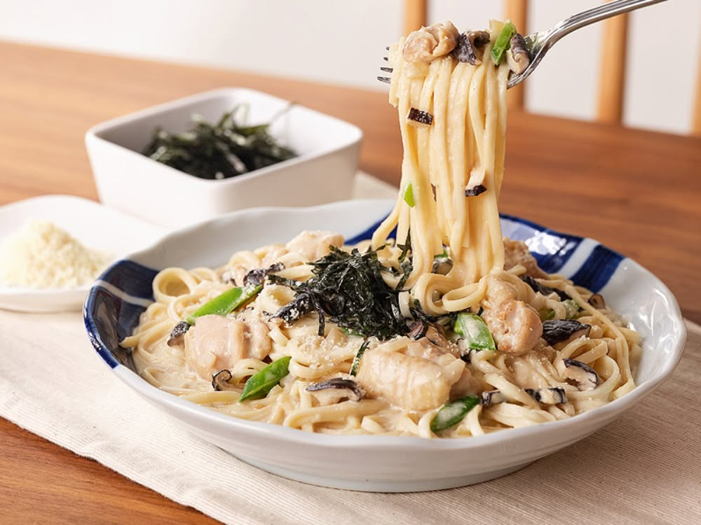

{ width=600 }

## 材料
- 鴻禧菇 50g（撕散）
- 洋蔥 1/8個（切薄片）
- 蒜頭 1粒（切片）
- 雞髀肉 1塊（切件）
- 鮮奶油 200cc
- 清酒 1湯匙
- 味淋 1湯匙
- 醬油 1湯匙
- 意大利麵 130g
- 鹽、黑胡椒 適量
- 煮麵水 適量

## 做法
1. 煎香雞髀肉至上色（不必全熟），盛起。  
2. 下蒜片、洋蔥炒至半透明，加入鴻禧菇炒至金黃。  
3. 加 2 湯匙水（或煮麵水）潤鍋。  
4. 加入鮮奶油、清酒、味淋、醬油，煮滾轉小火。  
5. 麵條加鹽水煮至 7–8 分熟，撈入醬汁內同煮；不足可酌加煮麵水或鮮奶油。  
6. 以鹽、黑胡椒調味，回鍋雞肉略煮至熟即可。  

[YouTube - 雞腿菇和風奶醬意粉](https://www.youtube.com/watch?v=EyPX0RxXo7M&t=210s)