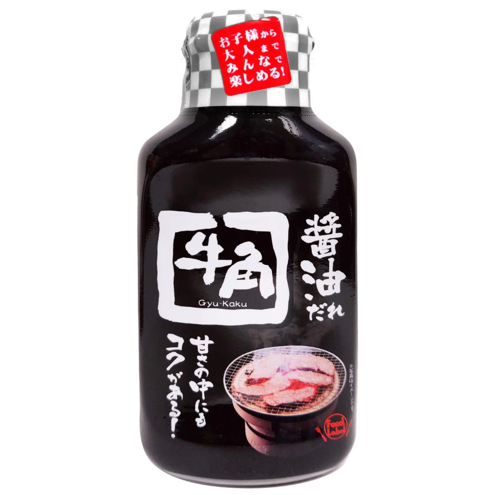

{ width=600 }

## 材料
- 味醂 2湯匙  
- 清酒 2湯匙  
- 糖 1湯匙  
- 味噌 1/2湯匙  
- 日式醬油 3湯匙  
- 白醋 1/2茶匙  
- 蒜蓉 2粒  
- 蘋果蓉 1/8個  
- 芝麻 2湯匙  

## 做法
1. 倒入味醂、清酒、糖，加熱至冒泡。  
2. 加入醬油、蒜蓉，加熱。  
3. 再加入白醋、味噌，加熱。  
4. 滾起後加入芝麻與蘋果蓉，拌勻即成。  
