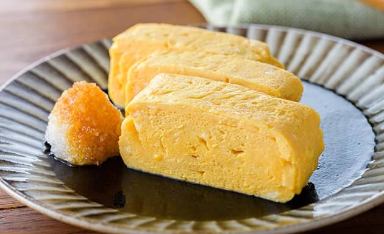

{ width=600 }

## 材料
- 雞蛋 2顆  
- 砂糖 5g  
- 味醂 5ml  
- 醬油 5ml  
- 鹽 少許  
- 烹大師 5g  

## 做法
1. 打散雞蛋，加入砂糖、味醂、醬油、鹽與烹大師，拌勻。  
2. 平底鍋抹少量油，加熱後倒入薄薄一層蛋液。  
3. 輕輕捲起，再將蛋捲推至鍋的一端。  
4. 重複倒入蛋液、捲起，直到蛋液用完。  
5. 成型後切片即可。  
