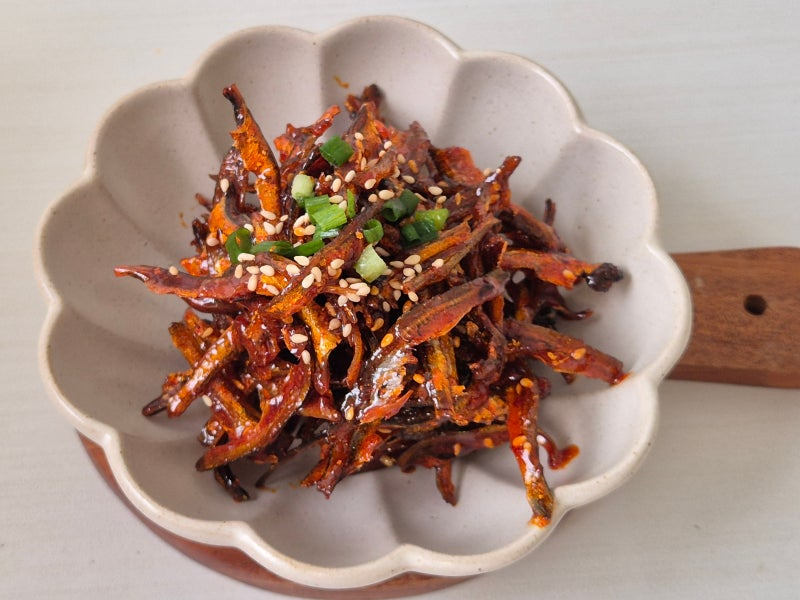

{ width=600 }

## 材料
- 銀魚乾仔 1杯  
- 醬油 2 tsp  
- 韓式辣椒粉 1 tbsp  
- 蒜蓉 1 tsp  
- 芝麻 1/2 tsp  
- 糖 1 tbsp  
- 麻油 1/2 tsp  
- 水 3 tbsp  
- 玉米糖漿 1/2 tbsp  

## 做法
1. 白鑊烘乾魚乾，聽到「啪啪」聲即可。  
2. 篩走炒碎的魚碎。  
3. 落少少油，加入醬油、辣椒粉、蒜蓉同水煮熱。  
4. 加入粟米糖漿和麻油。  
5. 熄火後放魚仔拌勻。  
6. 最後灑上芝麻即可。  
