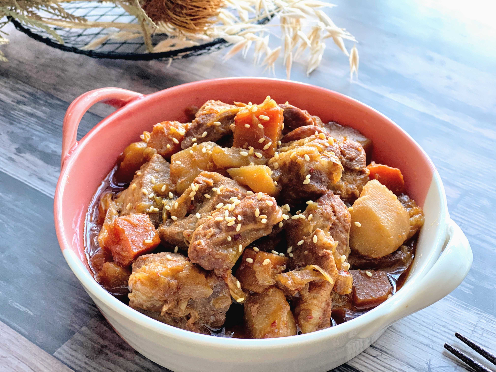

{ width=600 }

## 材料
- 五花肉 300g  
- 清酒 200g  
- 醬油 120g  
- 糖 50g  
- 薑 10g  
- 大蒜 30g  
- 芹菜 30g  
- 青蔥 20g  
- 水 約300g  

## 做法
1. 五花肉切件，下鍋煎至金黃。  
2. 倒入清酒煮2分鐘。  
3. 加入醬油、糖、薑、大蒜、芹菜、青蔥。  
4. 倒入水，水需高過肉面。  
5. 蓋子留縫避免腥味，煮30分鐘：10分鐘大火，10分鐘中火，10分鐘小火。  
6. 可加水煮蛋同燉。  
7. 放涼後再翻熱更加入味。  
