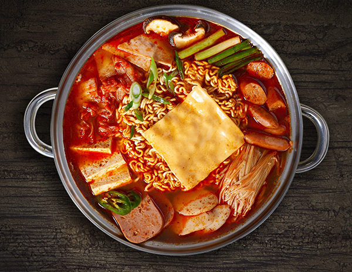

{ width=600 }

## 材料

### 主要食材
- 午餐肉（SPAM）1 罐
- 焗豆 1 罐
- 韓式泡菜 150g
- 香腸 100g
- 韓式年糕 100g
- 韓式即食麵 1 包（只取麵餅）
- 芝士片 2 片
- 蔥 3 根
- 金針菇 50g
- 秀珍菇 50g
- 清水 適量（水與材料比例約 1:1）

### 調味料
- 醬油 30g
- 糖 20g
- 韓式辣椒粉 10g
- 韓式辣椒醬 20g

## 做法
1. 午餐肉、香腸及蔥切成適口大小。
2. 金針菇及秀珍菇去掉根部，拆散備用。
3. 鍋內加入清水，水與材料比例約 1:1，再加入醬油、糖、韓式辣椒粉及韓式辣椒醬。
4. 放入午餐肉、香腸、焗豆、韓式泡菜、秀珍菇及蔥。
5. 加入年糕、即食麵麵餅及金針菇；年糕亦可預先煮過再加入。
6. 按鍋內情況補入少許清水，煮約 10 分鐘，至材料煮熟。
7. 最後放上芝士片即成。

## 重要備註
- 即食麵只用麵餅，不加入隨包附送的調味粉。
- 原食譜以水與材料約 1:1 作參考，沒有指定清水的毫升數。
- 年糕可以預先煮過，再加入鍋內。
- 芝士片最後才放上。

## 參考來源
[YouTube - 料理123：正韓部隊鍋](https://www.youtube.com/watch?v=uabxB0ZThtY)
